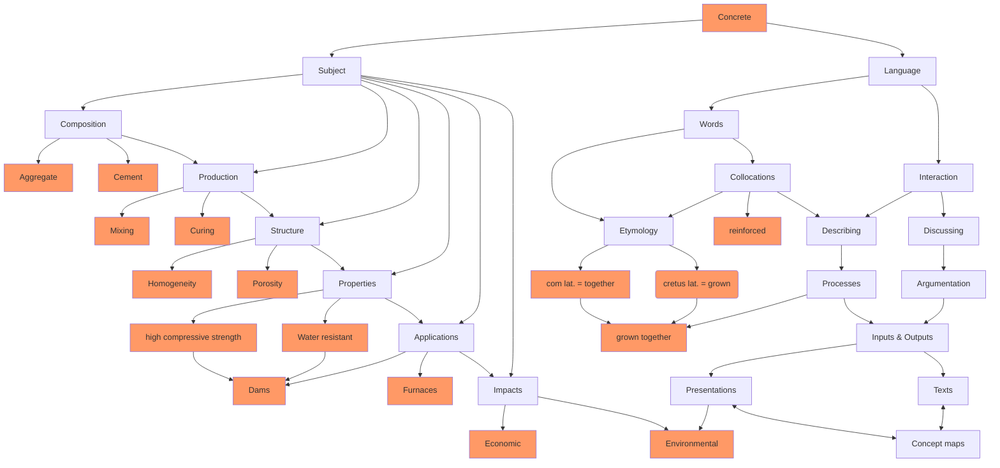

<!--
author:   Dr. Mark Jacob
email: mark.jacob@iuz.tu-freiberg.de
version:  0.0.1
language: en
narrator: UK English Female
comment: Content of week 3 WS 2023/2024
icon: https://upload.wikimedia.org/wikipedia/commons/thumb/e/e8/TUBAF_Logo.svg/800px-TUBAF_Logo.svg.png
script:   https://cdn.jsdelivr.net/npm/mermaid@10.5.0/dist/mermaid.min.js
import: https://raw.githubusercontent.com/liaScript/mermaid_template/master/README.md
-->

[](https://liascript.github.io/course/?https://github.com/TUBAF-IUZ-LiaScript/EF_BOB_23/blob/main/BOB_concept_maps.md)

# Concept maps

## sample map



## Concept map RK

```mermaid @mermaid

```

## Concept map SH

```mermaid @mermaid

```

## Concept map OL

```mermaid @mermaid

```

## Concept map BP

```mermaid @mermaid

```

## Concept map TR

```mermaid @mermaid

```

## Concept map FG

```mermaid @mermaid

```

## Concept map HG

```mermaid @mermaid

```

## Concept map NW

```mermaid @mermaid
 
```

## Concept map YH

```mermaid @mermaid

```

## Concept map MB

```mermaid @mermaid

```

## Concept map BM

```mermaid @mermaid

```

## Concept map NS

```mermaid @mermaid

```

## Concept map KS

```mermaid @mermaid

```

## Concept map LT

```mermaid @mermaid

```

## Concept map CR

```mermaid @mermaid

```

## Concept map EN

```mermaid @mermaid

```